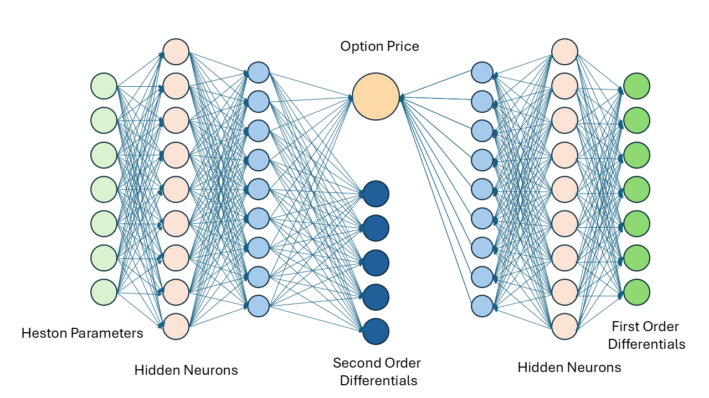

# DML-Heston-DiffPCA
 
In this project, **Differential Machine Learning (DML)** was applied to price European Options, using the computationally efficient version of Heston model. In addition, **Differential Principle Components Analysis (Diff-PCA)** was designed to improve the performance.

<center>

</center>

## Motivation:
<p>
Our goal is to train a feedforward neural network that takes in Heston parameters and prices a European option. However in other applications, the first derivatives (Delta) is often useful (e.g. hedging). Although its computation is efficient by virtue of Automatic Differentiation, it is usually excluded in the training. The original scheme of DML therefore takes into account the first order differentials as a training target, however it remains a theoretical question whether higher order differentials can be examined under the same principle. 
</p>

### Key Contributions:
1. **Extended Training Scheme**:  
   - Incorporates both first-order and second-order differentials into the training process.
   - Enables easy integration of higher-order differentials for any asset pricing model.

2. **Computational Efficiency with Diff-PCA**:  
   - Reduces the computational burden while preserving performance by leveraging Differential PCA.

3. **Theoretical Insights**:  
   - A detailed theoretical explanation of the approach is available. The approach is described using Hilbert Projection Theorem, Sobolev spaces and Proper Orthogonal Decomposition (POD).  
   - Full academic paper provided upon request (subject to academic policy).

---
## Repository Contents

In this repository, you will find:
- `data_generation.ipynb`: demonstrates the construction of the dataset. The original data are given by [Asridi] (https://github.com/asridi/DML-Calibration-Heston-Model). We here focus on the construction of second order differentials and Diff-PCA
- `model_training.ipynb`: establishes and trains different models:
    1.  the benchmark model (trained with no differentials)
    2.  Model trained with 1st order differentials
    3.  Model trained with both 1st and 2nd order differentials
    4.  Model trained with both 1st and 2nd order differentials, with Diff-PCA
    
- `model_testing.ipynb`: conducts a brief performance analysis on the models.

- `data` folder: contains Heston parameters, their second order differentials in csv files with `d2_` initials. They satisfy the Feller conditions and are provided from https://github.com/asridi/DML-Calibration-Heston-Model. The complete datset is in `dataset_100K_feller.csv`. In this demonstration, we only considered 10K datapoints. The data and their differentials (1st and 2nd order) are contained in `feller_d2.csv`.

- `model` folder: contains the trained models
- `results` folder: contains graphics and training records


---

## How to Use

1. Clone the repository:
   ```bash
   git clone https://github.com/wongpc0817/DML-Heston-DiffPCA.git
   cd DML-Heston-DiffPCA

2. Install dependencies: 
    ```
    pip install -r requirements.txt
    ```

3. Run the notebooks:

    Start with data_generation.ipynb to create the dataset.
    Proceed to model_training.ipynb for training.
    Use model_testing.ipynb for performance evaluation.


---
## References:
1. Fischer Black and Myron Scholes. *The pricing of options and corporate liabilities*. Journal of Political Economy, 81(3):637–654, 1973.
2. Benzion Boukai. *On the class of risk neutral densities under Heston’s stochastic volatility model for option valuation*. Mathematics, 11(9):2124, Apr 2023.
3. Damiano Brigo and Fabio Mercurio. *Interest Rate Models — Theory and Practice: With Smile, Inflation and Credit*. Springer Finance, 01 2006.
4. John C. Cox, Jonathan E. Ingersoll, and Stephen A. Ross. *A theory of the term structure of interest rates*. Econometrica, 53(2):385–407, 1985.
5. John C. Cox and Stephen A. Ross. *The valuation of options for alternative stochastic processes*. Journal of Financial Economics, 3(1):145–166, 1976.
6. Magnus Grønnegaard Frandsen, Tobias Cramer Pedersen, and Rolf Poulsen. *Delta force: option pricing with differential machine learning*. Digital Finance, 4:1–15, 2021.
7. Pedro Duarte Gomes. *Mathematics of differential machine learning in derivative pricing and hedging*, 2024.
8. Brian Huge and Antoine Savine. *Differential machine learning*, 2020.
9. Seung-Jean Kim, Kwangmoo Koh, Stephen Boyd, and Dimitry Gorinevsky. *ℓ1 trend filtering*. SIAM Review, 51(2):339–360, 2009.
10. Giovanni Leoni. *A first course in Sobolev spaces*. American Mathematical Society, 01 2009.
11. Alexander Lipton. *Mathematical methods for foreign exchange: A financial engineer’s approach*. Mathematical methods for foreign exchange, Oct 2001.
12. W. Rudin. *Functional Analysis*. International series in pure and applied mathematics. Tata McGraw-Hill, 1974.
13. Abir Sridi and Paul Bilokon. *Applying deep learning to calibrate stochastic volatility models*, 2023.
14. Po-Chai Wong and Jeff Chak-Fu Wong. *A modified hybrid RBF-BP network classifier for nonlinear estimation/classification and its applications*. In Chutiporn Anutariya and Marcello M. Bonsangue, editors, *Data Science and Artificial Intelligence*, pages 43–56, Singapore, 2023. Springer Nature Singapore.

